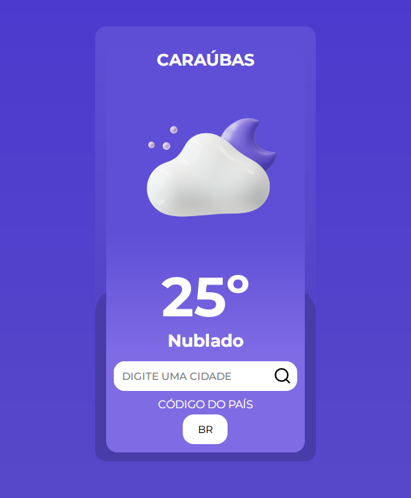

 <h1 align="center">Weather App</h1>

 
App de pesquisa de clima feito com ReactJs. Usando a API "Openweathermap"

 
 
<a href="https://weather-app-two-opal.vercel.app/" target="_blank">Acesse aqui.</a>

 

